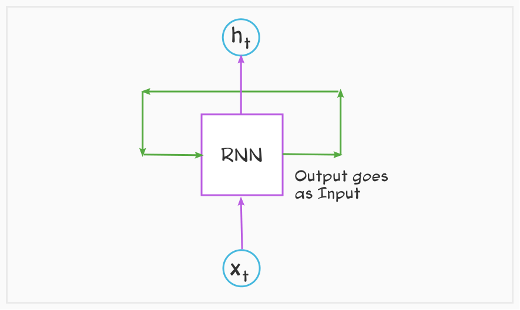
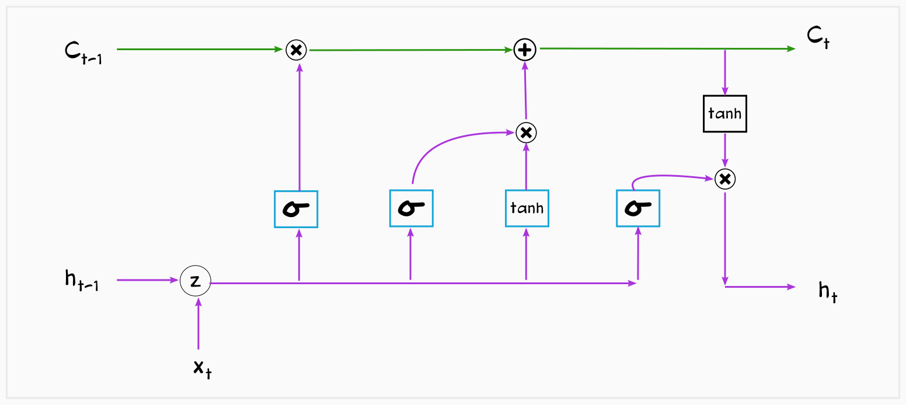
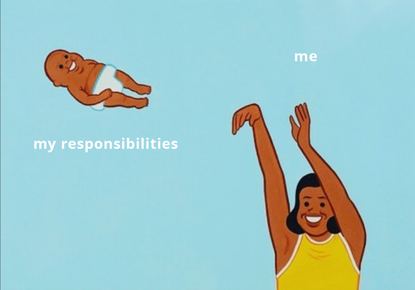
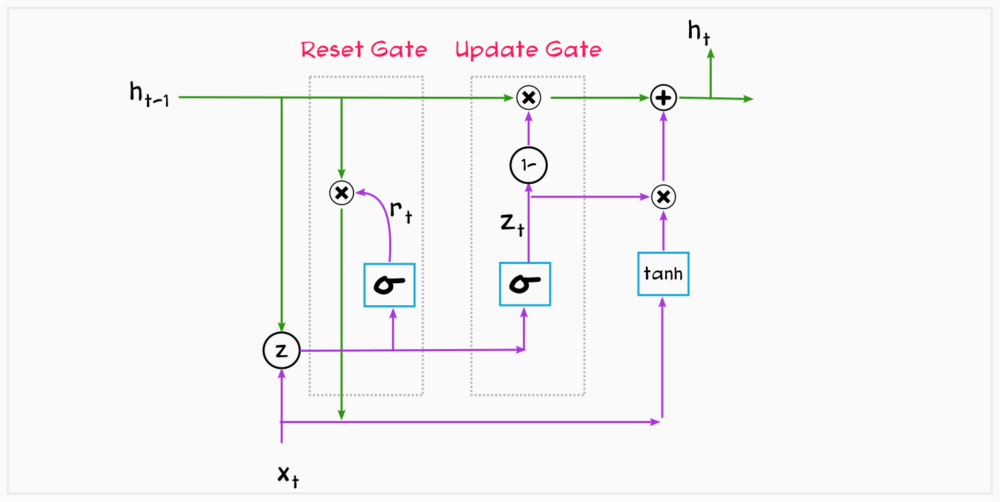
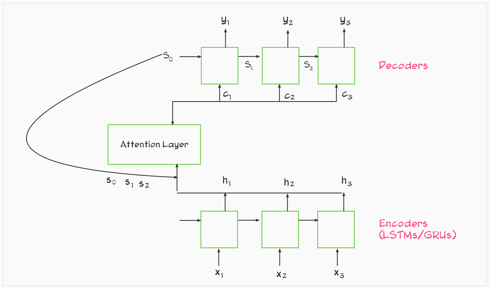

# **LSTMs**

The idea of LSTMs (Long Short-term Memory Networks) is closely related to the fact that we, humans, understand the context when we talk. And, there is no way a traditional neural network can help in storing this context. So Recurrent neural networks (RNNs) were invented to tackle this problem. These are networks with a recurring nature that allows information to persist.

A simple RNN looks like this:

A Simple RNN

It takes an input x and outputs ahidden state h. It also has another output which also goes as input to the RNN block. This way it has the ability to connect previous information to the current task. Though simple RNNs fail when it comes to understanding longer sequences of texts.

LSTMs are a special kind of RNN. It covers up the shortcomings of a simple RNN which is good for a short sequence of information.

LSTMs are capable of learning long-term dependencies. Its key part is - Cell state. The horizontal green line running in the below picture. It holds information on previous input sequences.

An LSTM Block

Process of LSTMs can be understood in the following 4 steps:

**Step 1** - Throw away what’s not needed

Source: KnowYourMeme

The incoming Cell state contains information about the whole input sequence up to that moment. The first task is to figure out what information to be thrown away from the Cell state. This decision is taken using a sigmoid layer called the **Forget gate**. It looks at the incoming input and the hidden state and produces numbers between 0 and 1. Values reaching towards 0 will be the ones that should be forgotten.

**Step 2** - Compute and keep what’s needed

Source: [Reddit](https://www.reddit.com/r/TheHobbitFaction/comments/9b4lmd/the_elves_are_here_to_honor_the_alliance_with_a/)

This is done by the part called the **Input gate**.

It has two parts, the first one is a Sigmoid layer and another is a tanh layer. Both of them figure out what information will be updated to the Cell state.

**Step 3** - Update the Cell State

Source: [Imgflip](https://imgflip.com/i/1xbpmi)

Now is the time to update the old Cell state to a new Cell state using the values calculated in the previous step.

**Step 4** - Compute what to output

Source: [Reddit](https://www.reddit.com/r/Texans/comments/j5u19z/looks_like_watching_the_games_is_back_on_the_menu/)

Run a sigmoid layer to decide which part of the new Cell state to output. This process happens at the **Output gate**.

Put the new Cell state through tanh and multiply it by the output of the sigmoid function, so that only selected parts are in the output.

# GRUs

A GRU Block

GRUs (Gated Recurrent Units) is the combination of both Peephole and Coupled Forget-Input LSTMs variants. You can read about these variants [here](https://colah.github.io/posts/2015-08-Understanding-LSTMs/).

In its architecture, it combines the forget and input gate into a single **update gate**. It also merges the cell state and hidden state, which is passed to both the gates as shown above in the picture. It works on the idea that more the information a network has, the better it will learn.

In the normal LSTM, forgetting unnecessary information happens using the Forget gate, and adding new information is decided by the Input gate. Both the operation can be handled at once. The idea is that if you have set aside the information to be forgotten, the rest of the information is to be stored, so use that. From this Coupled Forget-Input gate, the input to the Input gate is inverse of the Forget gate. This idea is referred to as Yin Yang.

**LSTMs vs GRUs**

There are no research papers claiming that GRUs are better than LSTMs. Though people prefer GRU because it uses less number of neural network which leads to less number of parameters and faster training time.

# Attention

In NLP tasks such as sentiment analysis, we only need to focus on the final output, where LSTMs/GRUs perform well. Though there are NLP tasks like Language translation where every output matters and LSTMs/GRUs do not perform that great there.

Attention mechanism comes to the rescue. It works with a set of encoders and decoders to handle the complexity of these tasks.

Attention is all you need!

It has a part called **context vector** that enables the decoder to focus on certain parts of the input while it predicts the output. Each context vector is a weighted sum of the outputs (h1, h2, h3) of the encoders.

To get the context vectors (c1, c2, c3), the Attention layer looks at all the values of h states and incoming values of s.

More details on Attention will come in the next part. So stay tuned!